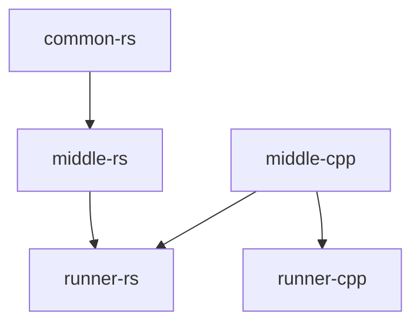

# Example project to integrate Rust and C++ together with cmake



## Building and running

### Rust

```shell
cargo run
```

### C++

```shell
cmake -B build -G Ninja
cmake --build build
./build/runner-cpp/runner-cpp
```
