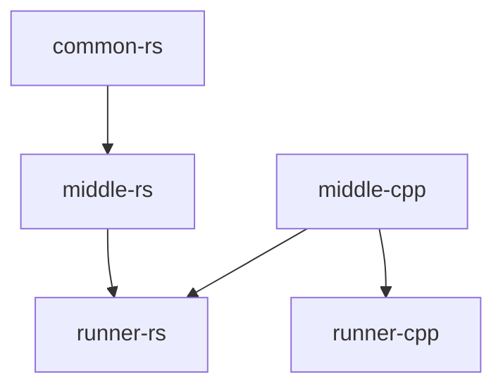

# Integrate Rust and C++ together with cmake

## Architecture



## TODO

- common-rs
    - Simple struct (with a method?)
    - Rust struct (with a method)
- common-cpp
    - Class with vec member
        - With method
- hidden-rs
    - Rust struct (with a method)
        - Uses common-cpp
- middle-cpp
    - Uses common-rs
    - Uses hidden-rs
- Exe (c++)
    - Uses middle-rs

## Building and running

### Rust

```shell
cargo run
```

### C++

```shell
cmake -B build -G Ninja
cmake --build build
./build/runner-cpp/runner-cpp
```
